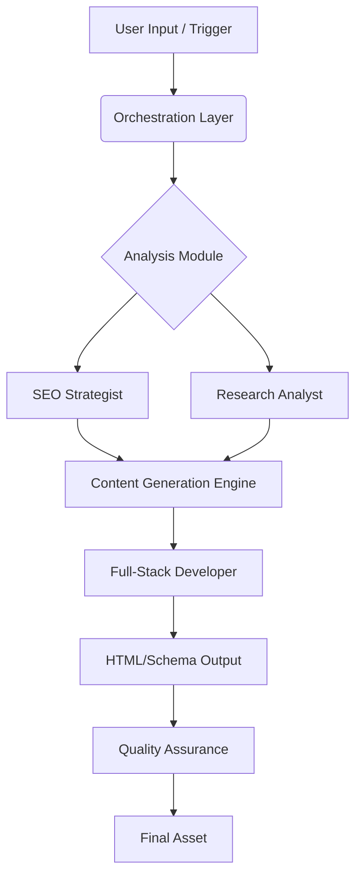

***

# Safe-Deep-Automation-Engine 🚀

> **The Future of AI Content is Deep, Not Wide.**

Welcome to the **Safe-Deep Generator™**, a production-grade intelligence engine designed to revolutionize how high-value digital assets are created. This is not just another AI writer; it is a sophisticated orchestration of a Senior SEO Strategist, a Full-Stack Developer, and a Research Analyst, all merged into a single, autonomous agent.

Safe-Deep Generator™ architects **entity-rich**, **AEO/GEO-optimized** pages with evidence-backed, search-dominating assets. It moves beyond shallow content generation to produce deep, authoritative, and structurally sound web pages that satisfy both search engine algorithms and human readers.

---

## 📑 Table of Contents

- [Introduction](#introduction)
- [The Philosophy: Deep vs. Wide](#the-philosophy-deep-vs-wide)
- [Core Capabilities](#core-capabilities)
- [Technical Architecture](#technical-architecture)
- [Installation & Setup](#installation--setup)
- [Usage Guide](#usage-guide)
- [AEO/GEO Optimization Strategies](#aeogeo-optimization-strategies)
- [Best Practices for Safe-Deep Content](#best-practices-for-safe-deep-content)
- [Contributing](#contributing)
- [License](#license)
- [Support & Contact](#support--contact)

---

## Introduction

In the rapidly evolving landscape of Search Engine Optimization (SEO) and Artificial Intelligence (AI), a critical shift is occurring. The era of "content farms" churning out thousands of shallow, generic articles is ending. Search engines, particularly Google with its continuous algorithm updates (like the Helpful Content Update and the rise of SGE - Search Generative Experience), are aggressively prioritizing **depth, authority, and user experience**.

The **Safe-Deep Generator™** was born from this necessity. It is a specialized automation engine built to generate content that is:

1.  **Safe:** Adhering to strict quality guidelines, avoiding hallucinations, and ensuring factual accuracy.
2.  **Deep:** Providing comprehensive coverage of topics, exploring nuances, and offering genuine value to the reader.
3.  **Automated:** Leveraging advanced AI to scale the production of high-quality assets without sacrificing integrity.

This repository contains the core logic, templates, and configuration files needed to deploy the Safe-Deep Generator™. Whether you are a digital agency, a content marketer, or a developer building the next generation of web applications, this tool provides the foundation for creating search-dominating assets.

---

## The Philosophy: Deep vs. Wide

The industry has long been obsessed with "wide" content strategies. The goal was to cover every possible keyword, no matter how trivial, to capture maximum traffic. This resulted in a web saturated with superficial lists, thin articles, and repetitive information.

**Safe-Deep Generator™** rejects this paradigm. Our philosophy is rooted in the concept of **"Deep Content"**:

*   **Entity-Centric:** Instead of just targeting keywords, we target *entities* (people, places, things, concepts) and their relationships. This aligns with how modern search engines understand the world (Knowledge Graph).
*   **Evidence-Backed:** Every claim made by the engine is supported by data, citations, or logical reasoning. We prioritize accuracy over speed.
*   **Comprehensive Coverage:** A single "Deep" page aims to be the definitive resource on a topic, reducing the need for users to click elsewhere (lowering bounce rates and increasing dwell time).
*   **AEO/GEO Focus:** We optimize for **Answer Engine Optimization (AEO)** and **Generative Engine Optimization (GEO)**. This means structuring content to be easily consumed and cited by AI assistants, voice search, and SGE results.

> **The future belongs to those who create depth.**

---

## Core Capabilities

The Safe-Deep Generator™ merges three distinct areas of expertise into a unified workflow:

### 1. Senior SEO Strategist Mode
*   **Keyword Intent Analysis:** Goes beyond simple volume to understand the *why* behind a search query.
*   **Competitor Gap Analysis:** Identifies what competitors are missing and fills those gaps with superior content.
*   **Internal Linking Architecture:** Automatically suggests and structures internal links to pass equity and guide users.
*   **SERP Feature Targeting:** Optimizes content specifically to win Featured Snippets, People Also Ask (PAA) boxes, and Knowledge Panels.

### 2. Full-Stack Developer Mode
*   **Semantic HTML5 Generation:** Produces clean, accessible, and semantically correct HTML that search engines love.
*   **Schema Markup Injection:** Automatically embeds structured data (JSON-LD) for Articles, FAQs, How-Tos, and more.
*   **Performance Optimization:** Ensures generated content is lightweight, fast-loading, and mobile-friendly.
*   **Dynamic Content Blocks:** Creates interactive elements like calculators, comparison tables, and dynamic charts.

### 3. Research Analyst Mode
*   **Source Verification:** Cross-references information across multiple authoritative sources before generating content.
*   **Data Synthesis:** Combines disparate data points into coherent narratives and insights.
*   **Trend Integration:** Incorporates the latest industry trends and news to keep content fresh and relevant.
*   **Fact-Checking:** Implements a multi-step verification process to minimize hallucinations.

---

## Technical Architecture

The engine is built on a modular, microservices-based architecture designed for scalability and reliability.



### Key Components

*   **Orchestration Layer:** Manages the workflow, passing context between modules and ensuring the final output meets all criteria.
*   **Analysis Module:** Deconstructs the user's request or target keyword to understand the scope and requirements.
*   **Generation Engine:** The core LLM (Large Language Model) interface, fine-tuned for long-form, authoritative content.
*   **Developer Module:** Handles the technical rendering, ensuring the content is not just good text, but a good *web page*.
*   **Quality Assurance:** A final review step that checks for readability, factual consistency, and SEO compliance.

---

## Installation & Setup

### Prerequisites

*   Node.js (v18 or higher)
*   npm or yarn
*   An API key for your preferred LLM provider (e.g., OpenAI, Anthropic, or a local model via Ollama)
*   (Optional) A database connection for storing generated assets and analytics

### Installation Steps

1.  **Clone the repository:**
    ```bash
    git clone https://github.com/Cyberteckmaster/Safe-Deep-Automation-Engine.git
    cd Safe-Deep-Automation-Engine
    ```

2.  **Install dependencies:**
    ```bash
    npm install
    ```

3.  **Configure environment variables:**
    Create a `.env` file in the root directory and add your API keys and configuration settings.
    ```env
    LLM_API_KEY=your_api_key_here
    LLM_PROVIDER=openai
    OUTPUT_FORMAT=html
    DEPTH_LEVEL=high
    ```

4.  **Run the initial setup:**
    ```bash
    npm run setup
    ```

5.  **Start the engine:**
    ```bash
    npm start
    ```

### Docker Support

For containerized deployment, use the provided Dockerfile:

```bash
docker build -t safe-deep-engine .
docker run -p 3000:3000 safe-deep-engine
```

---

## Usage Guide

### Basic Usage

The engine can be triggered via command line, API, or a web interface (if configured).

**Command Line:**
```bash
npm run generate -- --topic "The Future of Renewable Energy" --format "long-form"
```

**API Example:**
```javascript
const safeDeep = require('safe-deep-engine');

const content = await safeDeep.generate({
  topic: "Quantum Computing Basics",
  depth: "expert",
  targetAudience: "developers",
  includeSchema: true
});

console.log(content.html);
```

### Configuration Options

| Option | Description | Default |
| :--- | :--- | :--- |
| `--topic` | The main subject or keyword to target. | (Required) |
| `--depth` | Level of detail: `basic`, `intermediate`, `expert`. | `expert` |
| `--format` | Output format: `markdown`, `html`, `json`. | `html` |
| `--audience` | Target reader persona. | `general` |
| `--schema` | Enable/disable structured data injection. | `true` |
| `--sources` | Number of sources to reference. | `5` |

---

## AEO/GEO Optimization Strategies

The Safe-Deep Generator™ is specifically tuned for the new era of search: **Answer Engine Optimization (AEO)** and **Generative Engine Optimization (GEO)**.

### What is AEO?
AEO focuses on optimizing content to be the direct *answer* to a user's question, often for voice search or featured snippets.

*   **Direct Answers:** The engine structures content to provide clear, concise answers to common questions within the first 100 words.
*   **Question-Based Headings:** Uses H2 and H3 tags that are phrased as questions (e.g., "How does X work?").
*   **Conversational Tone:** Mimics natural language patterns used in voice queries.

### What is GEO?
GEO prepares content to be cited and synthesized by AI models like Google's SGE, Bing Chat, and others.

*   **Entity Salience:** Ensures key entities are clearly defined and their relationships are explicit.
*   **Citation Readiness:** Formats sources and data in a way that AI can easily extract and attribute.
*   **Structured Data:** Heavy use of Schema.org markup to help AI understand the content's context.
*   **Unique Insights:** Prioritizes original analysis and data over rehashed information, as AI models favor unique signals.

> **By combining AEO and GEO, Safe-Deep Generator™ ensures your content is visible in both traditional search results and the new wave of AI-driven interfaces.**

---

## Best Practices for Safe-Deep Content

To get the most out of the Safe-Deep Generator™, consider these best practices:

1.  **Start with a Clear Brief:** The more specific you are about the topic, audience, and goals, the better the output.
2.  **Review and Refine:** While the engine is powerful, human oversight is still valuable. Review the generated content for tone and brand alignment.
3.  **Leverage Internal Linking:** Use the engine's suggestions to build a strong internal link structure that guides users and search engines.
4.  **Update Regularly:** Content freshness is a ranking factor. Schedule periodic re-runs of the engine to update old articles with new information.
5.  **Monitor Performance:** Track how your "Deep" assets perform in search and adjust your strategy based on real-world data.
6.  **Diversify Content Types:** Don't just generate blog posts. Use the engine to create landing pages, documentation, FAQs, and resource hubs.

---

## Contributing

We welcome contributions from the community! Whether it's bug reports, feature requests, or code improvements, your help is appreciated.

### How to Contribute

1.  Fork the repository.
2.  Create a new branch for your feature or bug fix.
    ```bash
    git checkout -b feature/my-new-feature
    ```
3.  Make your changes and commit them.
    ```bash
    git commit -m "Add some feature"
    ```
4.  Push to the branch.
    ```bash
    git push origin feature/my-new-feature
    ```
5.  Open a Pull Request.

Please read our [Contributing Guide](CONTRIBUTING.md) for details on our code of conduct and the process for submitting pull requests.

---

## License

This project is licensed under the MIT License. See the [LICENSE](LICENSE) file for details.

---

## Support & Contact

If you have any questions, issues, or suggestions, please open an issue on GitHub or contact the maintainer directly.

*   **Repository:** [https://github.com/Cyberteckmaster/Safe-Deep-Automation-Engine](https://github.com/Cyberteckmaster/Safe-Deep-Automation-Engine)
*   **Maintainer:** CyberTeckMaster
*   **Email:** (Add your email here)

---

*Safe-Deep Generator™ is a trademark of CyberTeckMaster. All rights reserved.*
